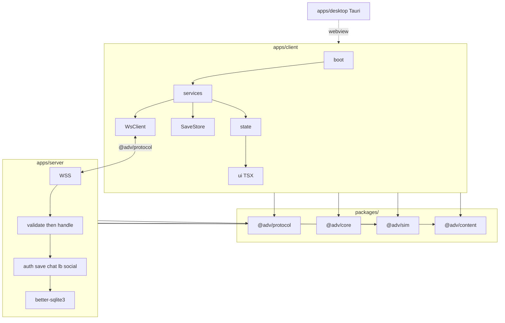

# Greenfield-Rewrite: Archiv des Vergessens v2

## Fortschritt (Stand)

| Phase | Status | Nachweis |
|---|---|---|
| **0 Fundament** | ✅ erledigt | Tag `v2-phase0`, PR [#1](https://github.com/Trobikus/archiv-des-vergessens-2/pull/1), `npm run gate` grün |
| **1 Kernel + Balancing** | ✅ erledigt | Tag `v2-phase1`, PR [#2](https://github.com/Trobikus/archiv-des-vergessens-2/pull/2), `npm run gate` grün |
| 2 Vertical Slice | ⬜ offen | — |
| 3 Content + Kampf/Story | ⬜ offen | — |
| 4 Server + Auth + Cloud | ⬜ offen (Freigabe) | — |
| 5 Tauri + E2E | ⬜ offen | — |
| 6 Parität A–F | ⬜ offen | — |
| 7 Social/Live | ⬜ offen | — |
| 8 Release 2.0.0 | ⬜ offen | — |
| 9 v1-Save-Importer | ⬜ optional | — |

**Als Nächstes:** Phase 2 — Vertical Slice (Klick/Tick → Ressourcen → Save/Load → Offline).

## Rahmen

- **Neu:** `F:\Max_Projekte\archiv-des-vergessens-2` (dieses Repo)
- **Referenz:** `F:\Max_Projekte\archiv-des-vergessens-1` bleibt read-only; ab Phase 2 nur noch Bugfixes
- **Scope:** Client + Server + Tauri + Persistenz + Content
- **Zeitrahmen (Solo + KI):** ca. 50–70 Arbeitstage
- **„Fehlerfrei“ = Prozess:** jede Phase endet nur mit grünem `npm run gate` (strict tsc, eslint 0 Warnings, Vitest, Build)

## Feste Architektur-Entscheidungen

| Thema | Entscheidung |
|---|---|
| Sprache | **TypeScript strict** ab Tag 1 (`noUncheckedIndexedAccess`, kein `any`) |
| UI | **Preact + `.tsx`** (`jsxImportSource: preact`); **htm entfällt** |
| Struktur | **npm-Workspaces:** `packages/*` + `apps/*` |
| Validierung | Mini-Validatoren in `@adv/protocol` (~120 LOC), kein zod |
| Persistenz | **Ein** Save-Envelope + Codec; Server-SQLite = Account-Autorität; IndexedDB = Cache/Offline-Queue; **kein** Tauri-rusqlite für Spielstände |
| Tauri | Nur Shell (Fenster, Updater, `quit_app`); **kein** Rust-`game_loop` |
| Saves | Breaking `schemaVersion: 1`; Migration-Runner ab Tag 1 vorhanden |
| Accounts | User-Tabelle (PBKDF2-Parameter **identisch**) migrieren; Cloud-Saves verwerfen |
| Balancing | Zahlen aus v1 **wortgleich**; Golden-Snapshot-Gate in CI |
| Stack sonst | Vite, pure CSS, WebSockets, `better-sqlite3` |



## Zielstruktur

```text
archiv-des-vergessens-2/
├─ package.json
├─ tsconfig.base.json
├─ packages/
│  ├─ protocol/   # WS-Events, Payloads, Validatoren, Save-Envelope
│  ├─ core/       # DI, EventBus, Store, Ticker, Logger, Result, BigNum, RNG
│  ├─ sim/        # reine Formeln (Kosten, Combat, Offline-Tick)
│  └─ content/    # Items, Bosse, Quests, i18n DE/EN
├─ apps/
│  ├─ client/     # Vite + Preact TSX
│  ├─ server/     # Node + ws, modular
│  └─ desktop/    # Tauri 2 Shell
├─ tools/gates|e2e
└─ docs/adr|parity-checklist.md|protocol.md|save-format.md
```

## Definition of Done (jede Phase)

1. `tsc --noEmit` 0 Fehler, strict
2. ESLint `--max-warnings=0` (`any` / `@ts-ignore` / Import-Zyklen = Error)
3. Vitest grün (Coverage: sim ≥90 %, core/protocol ≥85 %, Rest ≥60 %)
4. Client-Build OK; ab Phase 5 auch `cargo clippy -D warnings`
5. Balancing-Snapshot unverändert (außer explizite Freigabe)
6. Phasen-Playtest-Checkliste abgehakt + Git-Tag `v2-phaseN`

**Freigabe vorab nötig:** Phase 4 (Auth + DB-Schema) und jede Änderung an Balancing-Zahlen.

---

## Phasen

### Phase 0 — Fundament bootet ✅
**Status:** erledigt (Tag `v2-phase0`, PR [#1](https://github.com/Trobikus/archiv-des-vergessens-2/pull/1))

Erledigt:
- [x] npm Workspaces (`packages/*`, `apps/*`, `tools/*`)
- [x] TypeScript strict (`noUncheckedIndexedAccess`, kein `any`)
- [x] Vite + Preact-TSX Shell („Boot OK“)
- [x] Package-Stubs: `@adv/protocol`, `@adv/core`, `@adv/sim`, `@adv/content`
- [x] Server-Stub `@adv/server`, Desktop-Platzhalter (Phase 5)
- [x] ESLint (`--max-warnings=0`, Import-Zyklen), Vitest + Coverage-Gates
- [x] CI (`.github/workflows/ci.yml`), `npm run gate`
- [x] ADRs (`docs/adr/0001-stack.md`, `0002-persistence.md`)
- [x] `docs/parity-checklist.md` aus v1-Services/UI
- [x] `docs/protocol.md`, `docs/save-format.md`

### Phase 1 — Kernel + Balancing einfrieren ✅
**Status:** erledigt (Tag `v2-phase1`, PR [#2](https://github.com/Trobikus/archiv-des-vergessens-2/pull/2))

Erledigt:
- [x] `@adv/core`: DI, EventBus, Store, Ticker, Logger, Result, BigNum, RNG
- [x] `@adv/sim`: CONFIG + pure Math-Formeln (v1-Parität)
- [x] Golden-Snapshot `packages/sim/src/snapshots/balancing.golden.json`
- [x] Gate-Schritt `tools/gates/balancing-snapshot.mjs` in `npm run gate`

### Phase 2 — Erste Vertical Slice (5–7 Tage) ⬜
Klick/Tick → Ressourcen → Save/Load (IndexedDB) → Offline-Progress. Spielbar im Browser.

### Phase 3 — Content + Kampf/Story (6–8 Tage) ⬜
`@adv/content` mit typisierten Records aus `js/data/`, i18n DE/EN mit Key-Gate, Combat/Loot in `@adv/sim`, Combat- + Hero-UI.

### Phase 4 — Modularer Server + Auth + Cloud (Freigabe nötig) (7–9 Tage) ⬜
Modularer WS-Server, Events in `@adv/protocol`, Auth (Guest/Register/Login/Token/convertGuest), Cloud-Save, User-Migration aus v1-Kopie (Dry-Run zuerst).

### Phase 5 — Tauri-Shell + E2E (3–4 Tage) ⬜
Desktop-Shell ohne lokale Save-DB; Identifier + Updater-Key aus v1; Playwright-Smoke; Version `2.0.0`.

### Phase 6 — Feature-Parität Wellen A–F (12–18 Tage) ⬜
- A Quests / Achievements / Daily
- B Forge / Crafting / Gather
- C Talente / Challenges / Library
- D Story-Branches / Dialoge / Cinematics / Codex
- E Relic Hunt / Account-Vault / Combat-Analytics
- F Tutorial / Intro / Settings

### Phase 7 — Social/Live (5–7 Tage) ⬜
Chat, Freunde, Clan, Leaderboard — Client + Servermodule, serverseitige Validierung.

### Phase 8 — Härtung → Release 2.0.0 (4–6 Tage) ⬜
Perf-Budgets, Leak-Tests, a11y-Basis, Patch Notes, Updater-Rollout, v1-Cutover.

### Phase 9 (optional) — v1-Save-Importer ⬜
Nach Release: Adapter v1-JSON → v2-Envelope.

---

## Phasenfluss

```mermaid
graph LR
  P0["P0 Fundament ✅"] --> P1["P1 Kernel + sim ✅"]
  P1 --> P2["P2 Klick Save Offline ⬜"]
  P2 --> P3["P3 Content Kampf ⬜"]
  P3 --> P4["P4 Server Auth Cloud ⬜"]
  P4 --> P5["P5 Tauri E2E ⬜"]
  P5 --> P6["P6 Paritaet A-F ⬜"]
  P6 --> P7["P7 Social ⬜"]
  P7 --> P8["P8 Release 2.0.0 ⬜"]
  P8 -.optional.-> P9["P9 v1 Importer ⬜"]
```



## Portiert vs. neu

- **Wortgleich:** Content-Tabellen, i18n, CSS-Tokens, PBKDF2-Parameter
- **Logik neu getippt:** Math, RNG, Formatter, Sanitizer, Server-Backup/Integrity, Tauri-Commands
- **Komplett neu:** DI, State, Persistenz, alle Services, gesamte UI, Server-Module
- **Gestrichen:** Tauri-Save-DB, Rust-Game-Loop, htm, JSON-Legacy-Migrationen

## Risiken

1. Rewrite versandet → Parity-Checkliste einfrieren, keine Features bis Phase 8
2. Balancing-Drift → Snapshot-Gate in jeder CI
3. Auth-Regression → Freigabe + unveränderte Krypto + Security-Tests
4. Updater-Bruch → Identifier/Signing-Key aus v1 übernehmen und real testen
5. Account-Migration → nur Kopie, Dry-Run, v1-Server parallel bis Cutover

## Sofort-nächster Schritt

Phase 1 erledigt. Als Nächstes Phase 2: Vertical Slice (Klick/Ressource/Save/Offline).
