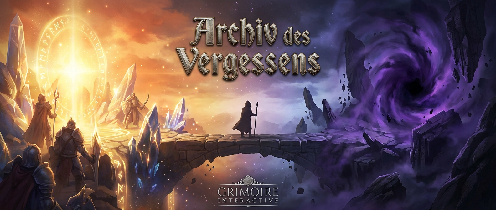

<p align="center">
  
</p>

# Archiv des Vergessens

### *Der Mneme-Bund* — Idle-/Progression-RPG

> Atmosphäre. Fortschritt. Archiv.  
> Ein vollständiger Greenfield-Rewrite — gleiche Welt, neue Grundlage.  
> **Frühe Alpha** — Systeme ändern sich, Inhalte fehlen, Fehler sind normal.

| | |
|---|---|
| **Studio** | [Grimoire Interactive](https://grimoire-interactive.de/) |
| **Version** | `0.2.4-alpha` · [](https://github.com/Trobikus/archiv-des-vergessens-2/releases/latest) [](https://github.com/Trobikus/archiv-des-vergessens-2/tags) |
| **Stand** | Rewrite-Phasen **0–9** code-seitig fertig · öffentlich **frühe Alpha** |
| **Stack** | TypeScript strict · Preact · Vite · Tauri 2 · Node WebSocket · SQLite |
| **Live-Server** | `wss://archiv.grimoire-interactive.de` |
| **Spieler-Download** | [`ArchivDesVergessens2-Launcher.exe`](https://github.com/Trobikus/archiv-des-vergessens-2/releases/latest/download/ArchivDesVergessens2-Launcher.exe) (Windows, portabel) |
| **Repo** | [Trobikus/archiv-des-vergessens-2](https://github.com/Trobikus/archiv-des-vergessens-2) |

Spieler-Patch Notes (Rewrite-Meilenstein) → [`docs/patch-notes-2.0.0.md`](docs/patch-notes-2.0.0.md)  
Changelog → [`CHANGELOG.md`](CHANGELOG.md)  
Studio-Site → [grimoire-interactive.de](https://grimoire-interactive.de/)

---

## Das Spiel

**Archiv des Vergessens** ist ein atmosphärisches Idle-RPG: Charakterfortschritt, Kampf, Crafting, Quests und Story — lokal offline-fähig, mit optionalem Cloud-Sync und Live-Diensten auf dem Server. Spielbar als Web-Client und als native Windows-Desktop-App über das **Siegel-Portal** (Launcher).

Die v2-Codebasis ist kein Refactor von v1, sondern ein **kompletter Neuaufbau** mit striktem TypeScript, klaren Paketgrenzen und einer gemeinsamen Protokollschicht für Web und Desktop. Balancing-Zahlen bleiben wortgleich zu v1 (Golden-Snapshot-Gate).

Die veröffentlichte Produktversion ist **`0.2.4-alpha`**. Dokumente mit der Bezeichnung „2.0.0“ beschreiben den Rewrite-Meilenstein (Feature-Parität / Cutover), nicht zwingend die aktuelle GitHub-Release-Nummer.

### Hub & Spielsysteme

Der Client organisiert den Hub in sieben Bereiche: **Archiv** · **Held** · **Story** · **Missionen** · **Werkstatt** · **Sammlung** · **Social**.

| Säule | Inhalte |
|---|---|
| **Idle & Fortschritt** | Klick / Tick, Gather-Upgrades, Offline-Produktion, Autosave, Cloud-Envelope |
| **Kampf & Held** | Combat-Sim, Floating Damage, Hero-Stats, Equip, Skilltree, Analytics |
| **Missionen & Craft** | Quests, Achievements, Daily, Schmiede, Crafting, Bibliothek |
| **Wissen & Macht** | Talente, Challenges, Codex, Reliktjagd, Account-Tresor |
| **Story** | Story-Kämpfe, Branches, Dialoge, Intro / Tutorial |
| **Social** | Globaler Chat & Bestenliste **live** (Server); Freunde & Clan (Idle / Raid / Expedition) **lokal im Client** |
| **Desktop** | Tauri-2-Shell, Siegel-Portal-Launcher, signierte portable ZIP, Chrome-Lockdown |

---

## Studio-Architektur

Eine Persistenzstrategie. Eine Protokollschicht. Klare Grenzen.

```text
┌─────────────────────────────────────────────────────────────┐
│  apps/launcher (Tauri 2) — Siegel-Portal · portable ZIP     │
│  apps/desktop  (Tauri 2)  — Fenster · quit_app · Lockdown   │
│         └─ webview ──────────────────────────────────────┐  │
│  apps/client   (Preact + Vite)  — UI · Session · Offline │  │
│         │  Save-Envelope (IndexedDB + Offline-Queue)     │  │
│         │  WsClient → wss://archiv.grimoire-interactive.de│ │
└─────────┼────────────────────────────────────────────────┼──┘
          │              @adv/protocol                     │
          ▼                                                ▼
   packages/core · sim · content              apps/server (WS :8080)
   DI · Events · Ticker · Math                Auth · Cloud-Save · Chat
   i18n DE/EN · Balancing                     Leaderboard · SQLite
```

### Design-Prinzipien

| Entscheidung | Umsetzung |
|---|---|
| **Eine Persistenz** | Client-Save-Envelope (IndexedDB / Offline-Queue); Server-SQLite = Account-Autorität — **keine** Spiel-DB in Tauri |
| **Tauri nur Shell** | Fenster, Quit, Lockdown — keine Rust-Game-Loop; Updates über den Launcher |
| **Auth bei jedem Start** | Optional nur Benutzername merken; Passwort immer manuell |
| **Desktop-Feel** | ESC → Spielmenü; Kontextmenü, Reload, Zoom und DevTools-Shortcuts in der Shell deaktiviert |
| **Balancing-Parität** | Zahlen/Formeln wortgleich zu v1 — Golden-Snapshot-Gate in CI |
| **Quality-first** | Jede Änderung hält `npm run gate` grün |
| **Branching** | Arbeit nur auf `main` |

Details: [`docs/REWRITE_PLAN.md`](docs/REWRITE_PLAN.md) · [`docs/adr/`](docs/adr/)

---

## Monorepo

| Fläche | Paket | Rolle |
|---|---|---|
| Spiel-Client | `@adv/client` | Preact-UI, Game-Session, Save / Offline |
| Live-Server | `@adv/server` | Auth, Cloud-Sync, Chat, Leaderboard, SQLite |
| Desktop-Shell | `@adv/desktop` | Tauri 2, Quit, Lockdown |
| Launcher | `@adv/launcher` | Siegel-Portal, portable ZIP, Ed25519-Verify |
| Simulation | `@adv/sim` | Balancing, Combat- / Idle-Mathe |
| Kernel | `@adv/core` | Store, Events, Ticker, DI, Pools |
| Protokoll | `@adv/protocol` | WS-Events, Validierung, Save-Typen |
| Content | `@adv/content` | i18n (DE/EN), Spieldaten |
| Gates | `@adv/gates` | CI- / DoD-Gate |
| E2E | `@adv/e2e` | Playwright-Smoke |

### Repository-Struktur

```text
archiv-des-vergessens-2/
├─ apps/
│  ├─ client/            Preact-Spielclient (Vite)
│  ├─ server/            WebSocket-Server (Auth / Cloud / Chat / Leaderboard)
│  ├─ desktop/           Tauri-2-Spielshell
│  └─ launcher/          Siegel-Portal (Spieler-EXE)
├─ packages/
│  ├─ core/              Runtime-Kernel
│  ├─ sim/               Spielsimulation & Balancing
│  ├─ protocol/          Netzwerkvertrag & Save-Envelope
│  └─ content/           Texte & Content-Pipeline
├─ tools/
│  ├─ gates/             CI- / DoD-Gate (`npm run gate`)
│  ├─ e2e/               Playwright-Smoke
│  ├─ migrate-v1-saves/  Spielstand-Migration v1 → v2
│  ├─ migrate-v1-users/  Account-Migration v1 → v2
│  └─ sign_release.mjs   Ed25519-Signatur portable ZIP
├─ deploy/
│  ├─ nginx/             TLS + WSS Reverse-Proxy
│  └─ caddy/             Alternative Proxy-Config
├─ site/                 Studio-Website (Cloudflare Pages)
├─ workers/
│  └─ contact/           Kontaktformular → kontakt@grimoire-interactive.de
├─ design/               Design-Referenzen / Szenen
├─ docs/                 Plan, ADRs, Legal, Checklisten
├─ .env.example
├─ wrangler.toml         Cloudflare Pages → ./site
├─ CHANGELOG.md
└─ README.md
```

---

## Schnellstart

### Voraussetzungen

- **Node.js** ≥ 22
- **npm** (Workspaces)
- Optional Desktop / Launcher: **Rust** + [Tauri 2](https://v2.tauri.app/) Prerequisites (unter Windows: WebView2)

### Web-Client & Server

```bash
npm install
npm run gate          # Typecheck, Lint, Tests, Build — DoD
npm run dev:client    # → http://localhost:5173
npm run dev:server    # WS-Server auf Port 8080
```

Lokal verbindet der Client in der Vite-Dev-Session typischerweise auf `ws://localhost:8080`.  
Produktion / Release-Builds nutzen `wss://archiv.grimoire-interactive.de` (siehe `.env.example`, `VITE_WS_URL`).

### Desktop & Launcher

```bash
npm run tauri:dev       # Spiel-Client im nativen Fenster
npm run launcher:dev    # Siegel-Portal lokal
npm run launcher:build  # Release-EXE des Launchers
```

Shell-Details: [`apps/desktop/README.md`](apps/desktop/README.md) · Launcher: [`apps/launcher/README.md`](apps/launcher/README.md)

### Qualität & E2E

```bash
npm test
npm run test:coverage
npm run e2e             # Playwright-Smoke (Client-Build nötig)
npm run clippy          # Rust-Lint Desktop-Shell
npm run clippy:launcher # Rust-Lint Launcher
```

---

## Skripte (Root)

| Befehl | Beschreibung |
|---|---|
| `npm run gate` | DoD-Gate (Snapshots, i18n, Version-Parity, a11y, Perf, tsc, eslint, vitest, build, optional clippy/e2e) |
| `npm run dev:client` | Vite-Devserver Client |
| `npm run dev:server` | Auth- / Cloud- / Social-Server (`tsx watch`) |
| `npm run tauri:dev` | Native Desktop-Session (Spiel) |
| `npm run launcher:dev` | Siegel-Portal Dev |
| `npm run launcher:build` | Siegel-Portal Release-EXE |
| `npm run build` | Client-Production-Build |
| `npm test` | Unit- / Integrationstests (Vitest) |
| `npm run test:coverage` | Coverage-Report |
| `npm run e2e` | Playwright-Smoke |
| `npm run clippy` | Desktop Rust-Lint (`-D warnings`) |
| `npm run clippy:launcher` | Launcher Rust-Lint |
| `npm run typecheck` | Projektweite TypeScript-Build-Graph |
| `npm run lint` | ESLint, max-warnings = 0 |
| `npm run migrate:v1-saves` | CLI: v1-JSON → v2-Envelope |

`npm install` setzt per `prepare` den Git-Hook-Pfad auf `.githooks` (Release-Tags erzwingen lokal `npm run gate`).

---

## Live-Server & Deploy

| Thema | Detail |
|---|---|
| **Öffentliche WSS-URL** | `wss://archiv.grimoire-interactive.de` |
| **Lokaler Default** | `ws://localhost:8080` (`PORT`, Default `8080`) |
| **Runtime-Override** | `localStorage["adv2_server_url"]` |
| **Build-Zeit** | `VITE_WS_URL` (siehe `.env.example`; in Releases fest gebacken) |
| **Upstream** | Node lauscht auf `127.0.0.1:8080`; Nginx/Caddy terminieren TLS auf 443 |
| **Proxy-Vorlagen** | [`deploy/nginx/nginx.conf`](deploy/nginx/nginx.conf) · [`deploy/caddy/Caddyfile`](deploy/caddy/Caddyfile) |
| **Server-Env** | `PORT`, `DATA_DIR`, `ALLOWED_ORIGINS`, `TRUST_PROXY=true` (hinter Proxy), `CLOUD_SAVE_VERSION` (Default `2.0.0`) |
| **Daten** | SQLite `database.db` unter `DATA_DIR` (Default `apps/server/data`) |
| **HTTP-Banner** | `GET /` → Klartext „Multiplayer-Server läuft“ (kein separates Health-API) |

Server-Module: **Auth**, **Cloud-Save**, **Chat**, **Leaderboard**.  
Freunde und Clan bleiben clientseitig (lokale Simulation), auch wenn die UI sie im Social-Hub zeigt.

Produktionsstart (Beispiel):

```bash
npm run start -w @adv/server
# bzw. mit Proxy:
TRUST_PROXY=true PORT=8080 npm run start -w @adv/server
```

---

## Roadmap — Phasen 0 → 9

| Phase | Status | Inhalt |
|---|---|---|
| **0** Fundament | ✅ | Monorepo, CI, ADRs, Parity-Checkliste |
| **1** Kernel + Balancing | ✅ | `@adv/core`, `@adv/sim`, Golden Snapshots |
| **2** Vertical Slice | ✅ | Klick / Tick / Save / Offline |
| **3** Content + Kampf / Story | ✅ | Combat, Hero, Story, i18n DE/EN |
| **4** Server + Auth + Cloud | ✅ | WS-Auth, Cloud-Sync, User-Migrationstool |
| **5** Tauri + E2E | ✅ | Desktop-Shell, Playwright |
| **6** Feature-Parität A–F | ✅ | Hub, Quests, Forge, Talente, Story, Tutorial |
| **7** Social / Live | ✅ | Chat, Freunde, Clan, Leaderboard |
| **8** Release-Meilenstein | ✅ | Perf, a11y, Patch Notes, Cutover-Docs |
| **9** v1-Save-Importer | ✅ | `importV1Save`, Options-UI, CLI `migrate-v1-saves` |


**Produktstatus danach:** frühe Alpha (`0.2.4-alpha`) — Playtest, Feinschliff, Inhalte.

Checklisten: [Parity](docs/parity-checklist.md) · [Playtest](docs/playtest-checklist.md) · [a11y](docs/a11y-checklist.md) · [Cutover](docs/cutover-v1.md)

---

## Release & Siegel-Portal

| Thema | Detail |
|---|---|
| **App-ID** | `com.grimoire.archivdesvergessens2` |
| **Spieler-EXE** | **`ArchivDesVergessens2-Launcher.exe`** — einziger Download für Spieler |
| **Artifacts** | Launcher · `archiv-des-vergessens-2.zip` · `.sig` — **kein** NSIS / Windows-Setup |
| **Installationspfad** | Standard `%APPDATA%\ArchivDesVergessens2\app\` (im Launcher wählbar) |
| **Updates** | Über den Launcher (GitHub Releases, Ed25519-Verify) — nicht über einen NSIS/`latest.json`-Setup-Pfad |
| **Workflow** | [`.github/workflows/release.yml`](.github/workflows/release.yml) — Tag `v*` oder `workflow_dispatch` |
| **CI** | [`.github/workflows/ci.yml`](.github/workflows/ci.yml) — Gate + Desktop + E2E |
| **Signatur** | `tools/sign_release.mjs` + Secret `ED25519_PRIVATE_KEY` |
| **Release-Draft** | Workflow veröffentlicht Releases als **Draft** — danach manuell publishen |

> **Cutover-Hinweis:** Cloud-Spielstände aus v1 werden serverseitig **nicht** automatisch übernommen.  
> Accounts (Benutzername + PBKDF2-Passwort) können migriert werden — Spieler melden sich neu an.  
> Spieler wechseln über den **v2-Launcher**. Lokale v1-Spielstände: Phase-9-Importer (unten).

Account-Migration: [`tools/migrate-v1-users/`](tools/migrate-v1-users/)

---

## Studio-Website & Kontakt

| Thema | Detail |
|---|---|
| **Site** | [`site/`](site/) — static HTML, Deploy per Cloudflare Pages (`wrangler.toml`) |
| **Domain** | [https://grimoire-interactive.de/](https://grimoire-interactive.de/) |
| **Kontakt-API** | [`workers/contact/`](workers/contact/) → `kontakt@grimoire-interactive.de` |
| **Rechtliches (Docs)** | `grimoire.interactive@gmail.com` |

---

## v1-Spielstände in v2 weiternutzen

v2 speichert in einem anderen Format (`SaveEnvelope`, `schemaVersion: 1`). Fortschritt aus v1 wird **nicht** still im Hintergrund übernommen — du importierst einen JSON-Dump einmalig.

### Was übernommen wird

Held, Ressourcen, Idle/Gather, Quests, Achievements, Crafting, Bibliothek, Talente, Challenges, Codex/Lore, Story-Branches, Reliktjagd, Freunde, Clan, Leaderboard-Rekorde, Tutorial/Settings, optional Account-Tresor.

### Was entfällt

- Chat-Verläufe (in v2 ephemer / serverseitig)
- Laufender Kampfzustand (`story.battleState`)
- Serverseitige v1-Cloud-Blobs (kein Auto-Cutover) — lokal exportieren und importieren

### Weg A — Im Spiel (empfohlen)

1. **v1-Save als JSON sichern** (einmal in v1 bzw. aus dem Browser/Desktop-WebView):
   - **IndexedDB:** DevTools → Application → IndexedDB → `ArchivDB` → Store `saves` → Eintrag des Slots (z. B. `slot_u…_1` oder `slot_guest_1`) als JSON exportieren/kopieren.  
     Akzeptiert wird das volle Envelope (`{ key, timestamp, state, … }`) oder nur `state`.
   - **Cloud-Cache (localStorage):** Key `archiv_cloud_save` → JSON kopieren (`{ userId, timestamp, saveData, … }`).
   - Optional Tresor: separater IDB-Key `vault_u…` / `account_vault` als `vaultData` / eigene Datei.
2. **v2 starten**, einloggen (oder Gast), **Einstellungen / Options** öffnen.
3. **„v1-Spielstand importieren“** → JSON-Datei wählen → Bestätigen.  
   Der aktuelle v2-Slot wird ersetzt; bei registriertem Account wird danach in die v2-Cloud gepusht.

### Weg B — CLI (Operator / Bulk)

```bash
# Dry-run: validieren + Kurzinfo
npm run migrate:v1-saves -- --source path/to/v1-save.json --out path/to/v2-envelope.json

# Schreiben
npm run migrate:v1-saves -- --source path/to/v1-save.json --out path/to/v2-envelope.json --apply

# Mit separatem Account-Tresor
npm run migrate:v1-saves -- \
  --source path/to/v1-save.json \
  --vault path/to/vault.json \
  --out path/to/v2-envelope.json \
  --apply
```

Akzeptierte Quellformen: innerer State, IDB-Envelope, Cloud-`saveData`, Bundle mit `vaultData`.  
Details: [`tools/migrate-v1-saves/`](tools/migrate-v1-saves/) · Format: [`docs/save-format.md`](docs/save-format.md) · API: `importV1Save` in `@adv/protocol`.

### Accounts vs. Spielstand

| Migration | Tool / Ort | Inhalt |
|---|---|---|
| **Login** | [`tools/migrate-v1-users/`](tools/migrate-v1-users/) | Benutzername + Passwort-Hash |
| **Fortschritt** | Options-UI oder `migrate:v1-saves` | v1-JSON → v2-Envelope |

Cutover-Runbook: [`docs/cutover-v1.md`](docs/cutover-v1.md)

---

## Dokumentation

| Dokument | Zweck |
|---|---|
| [`docs/REWRITE_PLAN.md`](docs/REWRITE_PLAN.md) | Gesamtplan, Phasen, Architektur |
| [`docs/patch-notes-2.0.0.md`](docs/patch-notes-2.0.0.md) | Spieler-Patch Notes (Rewrite-Meilenstein) |
| [`CHANGELOG.md`](CHANGELOG.md) | Keep a Changelog |
| [`docs/protocol.md`](docs/protocol.md) | WebSocket-Vertrag |
| [`docs/save-format.md`](docs/save-format.md) | Save-Envelope + v1-Import |
| [`docs/cutover-v1.md`](docs/cutover-v1.md) | v1 → v2 Produktions-Cutover |
| [`tools/migrate-v1-saves/`](tools/migrate-v1-saves/) | CLI v1-JSON → v2-Envelope |
| [`docs/parity-checklist.md`](docs/parity-checklist.md) | Feature-Parität zu v1 |
| [`docs/playtest-checklist.md`](docs/playtest-checklist.md) | Manueller Playtest |
| [`docs/a11y-checklist.md`](docs/a11y-checklist.md) | Accessibility-Basis |
| [`docs/adr/`](docs/adr/) | Architecture Decision Records |
| [`apps/desktop/README.md`](apps/desktop/README.md) | Desktop-Shell & Lockdown |
| [`apps/launcher/README.md`](apps/launcher/README.md) | Siegel-Portal |
| [`site/README.md`](site/README.md) | Studio-Website Deploy |

---

## Entwicklungshinweise

1. **Gate zuerst** — jede Änderung hält `npm run gate` grün.
2. **Vertrag spiegeln** — Protokoll- und Save-Format-Änderungen immer in `@adv/protocol` und den Docs nachziehen.
3. **v1 ist Referenz** — `archiv-des-vergessens-1` ist read-only; kein aktiver Feature-Port außer dokumentierter Parität.
4. **Paketgrenzen respektieren** — reine Sim-/Content-Logik bleibt frei von UI und I/O.
5. **Balancing schützen** — Zahlenänderungen brauchen grünen Golden-Snapshot.
6. **Nur `main`** — keine Feature-Branches, außer ausdrücklich gewünscht.

---

## Lizenz & Projekt

Privates Studio-Projekt von **Grimoire Interactive** (Mneme-Bund).

| Dokument | Inhalt |
|---|---|
| [`LICENSE`](LICENSE) | Proprietär — All Rights Reserved |
| [`docs/legal/PRIVACY.md`](docs/legal/PRIVACY.md) | Datenschutz / Privacy Policy (DE + EN) |
| [`docs/legal/EULA.md`](docs/legal/EULA.md) | Nutzungsbedingungen / EULA (DE + EN) |
| [`docs/legal/THIRD_PARTY_NOTICES.md`](docs/legal/THIRD_PARTY_NOTICES.md) | OSS- & Dritthinweise |

Offizielle Release-Builds dürfen persönlich und nicht-kommerziell gespielt werden; Source, Assets und Weitergabe sind ohne schriftliche Freigabe nicht gestattet.  
Rechtliches: **grimoire.interactive@gmail.com** · Kontaktformular: **kontakt@grimoire-interactive.de**

Repository: [github.com/Trobikus/archiv-des-vergessens-2](https://github.com/Trobikus/archiv-des-vergessens-2)

---

*Viel Erfolg im Archiv, Wanderer.*
