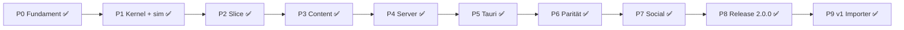

# 📜 Archiv des Vergessens

### *Der Mneme-Bund* — Idle-/Progression-RPG · Release **2.0.0**

> Atmosphäre. Fortschritt. Archiv.  
> Ein vollständiger Greenfield-Rewrite — gleiche Welt, neue Grundlage.

| | |
|---|---|
| **Version** | `2.0.0` |
| **Stand** | Phase **0–9 abgeschlossen** · inkl. v1-Save-Importer |
| **Stack** | TypeScript strict · Preact · Vite · Tauri 2 · Node WS |
| **Als Nächstes** | Release-Tag `v2.0.0` / Playtest |
| **Repo** | [Trobikus/archiv-des-vergessens-2](https://github.com/Trobikus/archiv-des-vergessens-2) |

Spieler-Patch Notes → [`docs/patch-notes-2.0.0.md`](docs/patch-notes-2.0.0.md)  
Changelog → [`CHANGELOG.md`](CHANGELOG.md)

---

## 🎮 Das Spiel

**Archiv des Vergessens** ist ein atmosphärisches Idle-RPG: Charakterfortschritt, Kampf, Crafting, Quests und Story — lokal offline-fähig, mit Cloud-Sync und Live-Social auf dem Server, als Web-Client und native Desktop-App.

Die v2-Codebasis ist kein Refactor von v1, sondern ein **kompletter Neuaufbau** mit striktem TypeScript, klaren Paketgrenzen und einer gemeinsamen Protokollschicht für Web und Desktop.

### Spielsysteme

| Säule | Inhalte |
|---|---|
| ⚙️ **Idle & Fortschritt** | Klick / Tick, Offline-Produktion, Autosave, Cloud-Envelope |
| ⚔️ **Kampf & Held** | Combat-Sim, Floating Damage, Hero-Stats, Equip, Analytics |
| 🗡️ **Hub & Craft** | Quests, Achievements, Daily, Schmiede, Crafting, Gather |
| 🧠 **Wissen & Macht** | Talente, Challenges, Bibliothek, Codex, Reliktjagd, Account-Tresor |
| 📖 **Story** | Story-Kämpfe, Branches, Dialoge, Intro / Tutorial |
| 🌐 **Social / Live** | Globaler Chat, Freunde, Clan (Idle / Raid / Expedition), Bestenliste |
| 🖥️ **Desktop** | Tauri-2-Shell, signierter Auto-Updater, Chrome-Lockdown |

---

## 🏛️ Studio-Architektur

Eine Persistenzstrategie. Eine Protokollschicht. Klare Grenzen.

```text
┌─────────────────────────────────────────────────────────────┐
│  apps/desktop  (Tauri 2)  — Fenster · Updater · quit_app    │
│         └─ webview ──────────────────────────────────────┐  │
│  apps/client   (Preact + Vite)  — UI · Session · Offline │  │
│         │  Save-Envelope (IndexedDB + Offline-Queue)     │  │
│         │  WsClient                                      │  │
└─────────┼────────────────────────────────────────────────┼──┘
          │              @adv/protocol                     │
          ▼                                                ▼
   packages/core · sim · content              apps/server (WS)
   DI · Events · Ticker · Math                Auth · Cloud · Chat
   i18n DE/EN · Balancing                     Leaderboard · SQLite
```

### Design-Prinzipien

| Entscheidung | Umsetzung |
|---|---|
| **Eine Persistenz** | Client-Save-Envelope (IndexedDB / Offline-Queue); Server-SQLite = Account-Autorität — **keine** Spiel-DB in Tauri |
| **Tauri nur Shell** | Fenster, Updater, `quit_app` — keine Rust-Game-Loop |
| **Auth bei jedem Start** | Optional nur Benutzername merken; Passwort immer manuell |
| **Desktop-Feel** | ESC → Spielmenü; Kontextmenü, Reload, Zoom und DevTools-Shortcuts in der Shell deaktiviert |
| **Balancing-Parität** | Zahlen/Formeln wortgleich zu v1 — Golden-Snapshot-Gate in CI |
| **Quality-first** | Jede Änderung hält `npm run gate` grün (tsc · eslint · vitest · build) |

Details: [`docs/REWRITE_PLAN.md`](docs/REWRITE_PLAN.md) · [`docs/adr/`](docs/adr/)

---

## 📦 Monorepo

| Fläche | Paket | Rolle |
|---|---|---|
| 🎮 Spiel-Client | `@adv/client` | Preact-UI, Game-Session, Save / Offline |
| 🛰️ Live-Server | `@adv/server` | Auth, Cloud-Sync, Chat, Leaderboard |
| 🪟 Desktop-Shell | `@adv/desktop` | Tauri 2, Updater, Quit |
| 🧮 Simulation | `@adv/sim` | Balancing, Combat- / Idle-Mathe |
| ⚙️ Kernel | `@adv/core` | Store, Events, Ticker, DI, Pools |
| 📡 Protokoll | `@adv/protocol` | WS-Events, Validierung, Save-Typen |
| 📚 Content | `@adv/content` | i18n (DE/EN), Spieldaten |
| ✅ Gates | `@adv/gates` | CI- / DoD-Gate |
| 🧪 E2E | `@adv/e2e` | Playwright-Smoke |

### Repository-Struktur

```text
archiv-des-vergessens-2/
├─ apps/
│  ├─ client/          Preact-Spielclient (Vite)
│  ├─ server/          Modularer WebSocket-Server
│  └─ desktop/         Tauri-2-Shell
├─ packages/
│  ├─ core/            Runtime-Kernel
│  ├─ sim/             Spielsimulation & Balancing
│  ├─ protocol/        Netzwerkvertrag & Save-Envelope
│  └─ content/         Texte & Content-Pipeline
├─ tools/
│  ├─ gates/           CI- / DoD-Gate (`npm run gate`)
│  ├─ e2e/             Playwright-Smoke
│  └─ migrate-v1-users/  Account-Migration v1 → v2
├─ docs/
│  ├─ REWRITE_PLAN.md
│  ├─ patch-notes-2.0.0.md
│  ├─ protocol.md · save-format.md · cutover-v1.md
│  ├─ parity- / playtest- / a11y-checklist.md
│  └─ adr/             Architekturentscheidungen
├─ CHANGELOG.md
└─ README.md
```

---

## 🚀 Schnellstart

### Voraussetzungen

- **Node.js** ≥ 22
- **npm** (Workspaces)
- Optional Desktop: **Rust** + [Tauri 2](https://v2.tauri.app/) Prerequisites (unter Windows: WebView2)

### Web-Client & Server

```bash
npm install
npm run gate          # Typecheck, Lint, Tests, Build — DoD
npm run dev:client    # → http://localhost:5173
npm run dev:server    # WS-Server (Auth / Cloud / Social)
```

### Desktop

```bash
npm run tauri:dev     # Client + natives Fenster
```

Shell-Details: [`apps/desktop/README.md`](apps/desktop/README.md)

### Qualität & E2E

```bash
npm test
npm run test:coverage
npm run e2e           # Playwright-Smoke (Client-Build nötig)
npm run clippy        # Rust-Lint der Desktop-Shell
```

---

## 🛠️ Skripte (Root)

| Befehl | Beschreibung |
|---|---|
| `npm run gate` | DoD-Gate (tsc, eslint, vitest, build, a11y-Basis) |
| `npm run dev:client` | Vite-Devserver Client |
| `npm run dev:server` | Auth- / Cloud- / Social-Server |
| `npm run tauri:dev` | Native Desktop-Session |
| `npm run build` | Client-Production-Build |
| `npm test` | Unit- / Integrationstests |
| `npm run test:coverage` | Coverage-Report |
| `npm run e2e` | Playwright-Smoke |
| `npm run clippy` | Desktop Rust-Lint (`-D warnings`) |
| `npm run typecheck` | Projektweite TypeScript-Build-Graph |
| `npm run lint` | ESLint, max-warnings = 0 |

---

## 🗺️ Roadmap — Phasen 0 → 9

| Phase | Status | Inhalt |
|---|---|---|
| **0** Fundament | ✅ | Monorepo, CI, ADRs, Parity-Checkliste |
| **1** Kernel + Balancing | ✅ | `@adv/core`, `@adv/sim`, Golden Snapshots |
| **2** Vertical Slice | ✅ | Klick / Tick / Save / Offline |
| **3** Content + Kampf / Story | ✅ | Combat, Hero, Story, i18n DE/EN |
| **4** Server + Auth + Cloud | ✅ | WS-Auth, Cloud-Sync, User-Migrationstool |
| **5** Tauri + E2E | ✅ | Desktop-Shell, Updater-Pfad, Playwright |
| **6** Feature-Parität A–F | ✅ | Hub, Quests, Forge, Talente, Story, Tutorial |
| **7** Social / Live | ✅ | Chat, Freunde, Clan, Leaderboard |
| **8** Release 2.0.0 | ✅ | Perf, a11y, Patch Notes, Updater-Rollout, Cutover |
| **9** v1-Save-Importer | ✅ | `importV1Save`, Options-UI, CLI `migrate-v1-saves` |



### Phase 8 — geliefert

- ⚡ `PERFORMANCE_BUDGETS` + `FrameBudgetMonitor` (Degradation bei Rucklern)
- 🧩 `ObjectPool` / `DomPool` für Floating-Combat-Text; Leak-Tests
- ♿ a11y-Basis-Checkliste + Gate + Playwright-Landmark-Smoke
- 📝 `CHANGELOG.md` + spielerseitige Patch Notes
- 🔐 Updater: `createUpdaterArtifacts`, v2-`latest.json`-Feed, `release.yml`
- 📋 Cutover-Runbook [`docs/cutover-v1.md`](docs/cutover-v1.md); Versionen vereinheitlicht auf `2.0.0`

Checklisten: [Parity](docs/parity-checklist.md) · [Playtest](docs/playtest-checklist.md) · [a11y](docs/a11y-checklist.md) · [Cutover](docs/cutover-v1.md)

---

## 🔐 Release & Desktop-Updater

| Thema | Detail |
|---|---|
| **App-ID** | `com.grimoire.archivdesvergessens` (aus v1 portiert) |
| **Feed** | `…/archiv-des-vergessens-2/releases/latest/download/latest.json` |
| **Artifacts** | Signierte NSIS-Bundles via `createUpdaterArtifacts` |
| **Workflow** | [`.github/workflows/release.yml`](.github/workflows/release.yml) |
| **CI** | [`.github/workflows/ci.yml`](.github/workflows/ci.yml) — Gate + Desktop-Job |

> **Cutover-Hinweis:** Cloud-Spielstände aus v1 werden serverseitig **nicht** automatisch übernommen.  
> Accounts (Benutzername + PBKDF2-Passwort) können migriert werden — Spieler melden sich neu an.  
> v1-Clients bleiben auf dem v1-Updater-Feed, bis der v2-Build manuell installiert wird.  
> Lokale v1-Spielstände kannst du über den Phase-9-Importer weiternutzen (siehe unten).

Account-Migration: [`tools/migrate-v1-users/`](tools/migrate-v1-users/)

---

## 💾 v1-Spielstände in v2 weiternutzen

v2 speichert in einem anderen Format (`SaveEnvelope`, `schemaVersion: 1`). Fortschritt aus v1 wird **nicht** still im Hintergrund übernommen — du importierst einen JSON-Dump einmalig.

### Was übernommen wird

Held, Ressourcen, Idle/Gather, Quests, Achievements, Crafting, Bibliothek, Talente, Challenges, Codex/Lore, Story-Branches, Reliktjagd, Freunde, Clan, Leaderboard-Rekorde, Tutorial/Settings, optional Account-Tresor.

### Was entfällt

- Chat-Verläufe (in v2 ephemer / serverseitig)
- Laufender Kampfzustand (`story.battleState`)
- Serverseitige v1-Cloud-Blobs (kein Auto-Cutover) — lokal exportieren und importieren

### Weg A — Im Spiel (empfohlen)

1. **v1-Save als JSON sichern** (einmal in v1 bzw. aus dem Browser/Desktop-WebView):
   - **IndexedDB:** DevTools → Application → IndexedDB → `ArchivDB` → Store `saves` → Eintrag des Slots (z. B. `slot_u…_1` oder `slot_guest_1`) als JSON exportieren/kopieren.  
     Akzeptiert wird das volle Envelope (`{ key, timestamp, state, … }`) oder nur `state`.
   - **Cloud-Cache (localStorage):** Key `archiv_cloud_save` → JSON kopieren (`{ userId, timestamp, saveData, … }`).
   - Optional Tresor: separater IDB-Key `vault_u…` / `account_vault` als `vaultData` / eigene Datei.
2. **v2 starten**, einloggen (oder Gast), **Einstellungen / Options** öffnen.
3. **„v1-Spielstand importieren“** → JSON-Datei wählen → Bestätigen.  
   Der aktuelle v2-Slot wird ersetzt; bei registriertem Account wird danach in die v2-Cloud gepusht.

### Weg B — CLI (Operator / Bulk)

```bash
# Dry-run: validieren + Kurzinfo
npm run migrate:v1-saves -- --source path/to/v1-save.json --out path/to/v2-envelope.json

# Schreiben
npm run migrate:v1-saves -- --source path/to/v1-save.json --out path/to/v2-envelope.json --apply

# Mit separatem Account-Tresor
npm run migrate:v1-saves -- \
  --source path/to/v1-save.json \
  --vault path/to/vault.json \
  --out path/to/v2-envelope.json \
  --apply
```

Akzeptierte Quellformen: innerer State, IDB-Envelope, Cloud-`saveData`, Bundle mit `vaultData`.  
Details: [`tools/migrate-v1-saves/`](tools/migrate-v1-saves/) · Format: [`docs/save-format.md`](docs/save-format.md) · API: `importV1Save` in `@adv/protocol`.

### Accounts vs. Spielstand

| Migration | Tool / Ort | Inhalt |
|---|---|---|
| **Login** | [`tools/migrate-v1-users/`](tools/migrate-v1-users/) | Benutzername + Passwort-Hash |
| **Fortschritt** | Options-UI oder `migrate:v1-saves` | v1-JSON → v2-Envelope |

Cutover-Runbook: [`docs/cutover-v1.md`](docs/cutover-v1.md)

---

## 📖 Dokumentation

| Dokument | Zweck |
|---|---|
| [`docs/REWRITE_PLAN.md`](docs/REWRITE_PLAN.md) | Gesamtplan, Phasen, Architektur |
| [`docs/patch-notes-2.0.0.md`](docs/patch-notes-2.0.0.md) | Spieler-Patch Notes 2.0.0 |
| [`CHANGELOG.md`](CHANGELOG.md) | Keep a Changelog |
| [`docs/protocol.md`](docs/protocol.md) | WebSocket-Vertrag |
| [`docs/save-format.md`](docs/save-format.md) | Save-Envelope + v1-Import |
| [`docs/cutover-v1.md`](docs/cutover-v1.md) | v1 → v2 Produktions-Cutover |
| [`tools/migrate-v1-saves/`](tools/migrate-v1-saves/) | CLI v1-JSON → v2-Envelope |
| [`docs/parity-checklist.md`](docs/parity-checklist.md) | Feature-Parität zu v1 |
| [`docs/playtest-checklist.md`](docs/playtest-checklist.md) | Manueller Playtest |
| [`docs/a11y-checklist.md`](docs/a11y-checklist.md) | Accessibility-Basis |
| [`docs/adr/`](docs/adr/) | Architecture Decision Records |
| [`apps/desktop/README.md`](apps/desktop/README.md) | Desktop-Shell & Lockdown |

---

## 🧭 Entwicklungshinweise

1. **Gate zuerst** — jede Änderung hält `npm run gate` grün.
2. **Vertrag spiegeln** — Protokoll- und Save-Format-Änderungen immer in `@adv/protocol` und den Docs nachziehen.
3. **v1 ist Referenz** — `archiv-des-vergessens-1` ist read-only; kein aktiver Feature-Port außer dokumentierter Parität.
4. **Paketgrenzen respektieren** — reine Sim-/Content-Logik bleibt frei von UI und I/O.
5. **Balancing schützen** — Zahlenänderungen brauchen grünen Golden-Snapshot.

---

## 📜 Lizenz & Projekt

Privates Studio-Projekt des **Mneme-Bunds**.

Repository: [github.com/Trobikus/archiv-des-vergessens-2](https://github.com/Trobikus/archiv-des-vergessens-2)

---

*Viel Erfolg im Archiv, Wanderer.*
